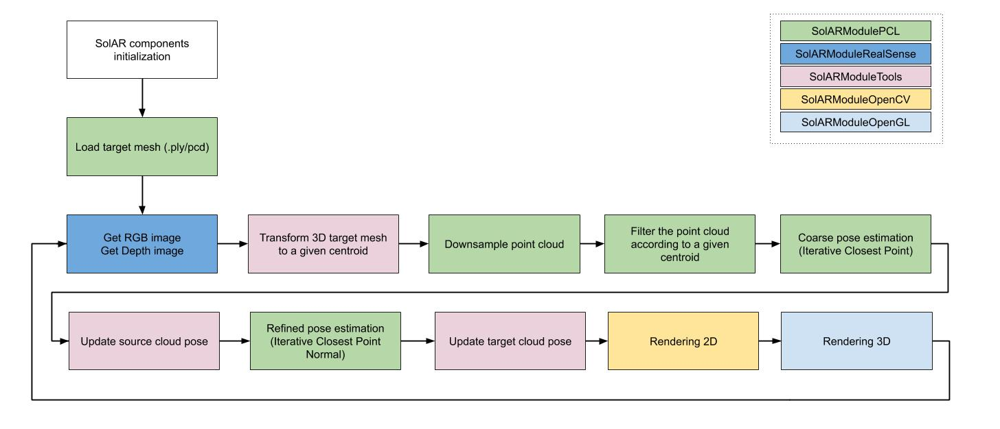
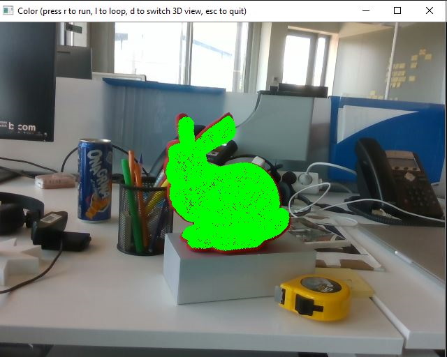
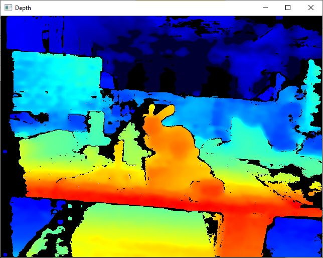
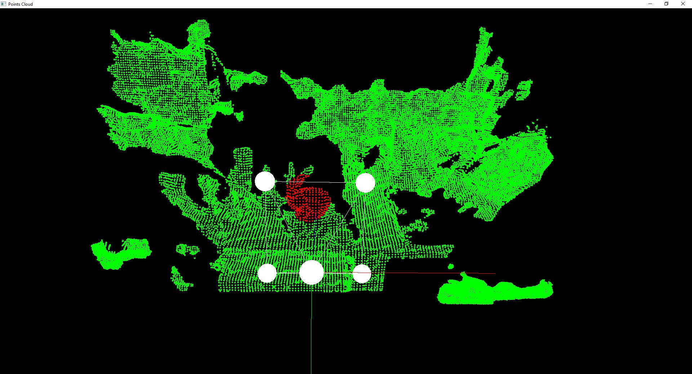

# DEPRECATED - This repo is no longer maintained
----
# Sample-DepthCamera

The SolAR **Depth sample** show a SolAR pipeline for augmented reality based using [ Intel® RealSense™](https://www.intelrealsense.com/) depth camera

This pipeline loads a 3D mesh, then it tries to detect on real time camera images the same 3D printed mesh. If it exists in the depth map, the virtual mesh is aligned to the printed one using Iterative Closest Point (ICP) to estimate the pose.

|  |
|:-:|
| Depth pipeline |

## How to run it

### StandAlone
* To run it, first print the 3D [Bunny](./StandAlone/bunny_10000_opencv.ply) mesh.
* Put it in center front of the camera (at least > 20cm)
* Open a terminal and execute `./bin/Release/SolARSample_DepthCamera_Mono.exe`
* Press `R` to run pipeline for the current frame (use `L` to run on every frame)
* Press `escape` to quit the application
* If you want to change properties of the components of the pipeline, edit the [SolARSample_DepthCamera_Mono](./SolARSample_DepthCamera_Mono/SolARSample_DepthCamera_Mono_conf.xml) file

|  |  |  |
|:-:|:-:|:-:|
| RGB | 2D Depth Map | 3D Depth Map |

### Plugin
**Unity plugin coming soon**

## Contact
Website https://solarframework.github.io/

Contact framework.solar@b-com.com
